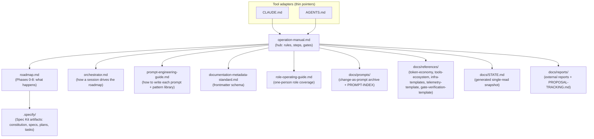

# AI Assisted SDD Template

This repository is a reusable template for starting a documentation-first, AI-assisted software project. It provides the governance, operating instructions, roadmap artifacts, and repository structure needed to bootstrap a new product or platform without beginning from a blank slate.

The template is designed to support human-led and agent-assisted development with clear phase gates, living documentation, and versioned decisions. It is intentionally focused on process, continuity, and traceability before implementation code is added.

## Table of contents

- [What this template provides](#what-this-template-provides)
- [Key documents](#key-documents)
- [Repository layout](#repository-layout)
- [Visual overview](#visual-overview)
- [How to use this template](#how-to-use-this-template)
- [Future extensions (not yet adopted)](#future-extensions-not-yet-adopted)
- [Operating principles](#operating-principles)

## What this template provides

- A reusable operating model for AI-assisted software delivery.
- Governance and decision records for project continuity.
- Phase-oriented instruction documents for orchestration and execution.
- A docs-oriented structure for handbook, status, risks, ADRs, and reference material.
- A foundation for future implementation work under a controlled workflow.

## Key documents

### Start here

- [Quickstart](QUICKSTART.md) — the three-step on-ramp (use template, `/template-init`, `/orchestrator`); start here before anything else below.
- [Operation manual](docs/manuals/operation-manual.md)
- [Orchestrator prompt](agents/orchestrator.md)
- [Template init prompt](agents/init.md) — idempotent Phase 0 bootstrap (`/template-init` in Claude Code).

### Governance & decisions

- [ADR-0002: Intended adopter tier](docs/adr/0002-audience-tier.md) — Accepted: consultancy/agency, executed solo; see "Future extensions" below for what it unblocks.
- [ADR-0003: Document architecture principles](docs/adr/0003-document-architecture.md) — the five patterns behind this repo's document system, with their CI enforcement.
- [ADR-0004: Category directories for docs/manuals/ content](docs/adr/0004-docs-category-directories.md) — `docs/adr/`, `docs/strategy/`, `docs/visuals/`, extending ADR-0003 rather than superseding it.
- [ADR-0005: Public-mirror release via licorsy/ai-assisted-sdd-template](docs/adr/0005-public-release.md) — publishes a new public repository seeded with a single fresh commit; amended 2026-07-31 to record this repository as the current source of truth, after the original private source repository was archived.
- [Business software development roadmap](docs/strategy/roadmap.md)
- [Go-to-market roadmap](docs/strategy/go-to-market.md) — optional, parallel commercial-lifecycle roadmap; not a gate every increment passes through.
- [Orchestrator reviewer prompt](agents/phase-reviewer.md)
- [Adversarial review prompt](agents/adversarial.md) — stress-tests a spec/plan's merit before Phase 3 locks in.
- [Doc consistency reviewer prompt](agents/doc-consistency.md) — full-corpus cross-document audit, run on demand or at cycle close.

### Guides & references

- [Documentation metadata standard](docs/manuals/documentation-metadata-standard.md)
- [Role operating guide](docs/manuals/role-operating-guide.md)
- [Agent design guide](docs/manuals/agent-design-guide.md) — workflow-vs-agent decision, agent design checklist, and agent testing dimensions.
- [Prompt engineering guide](docs/manuals/prompt-engineering-guide.md) — how to write an individual prompt (specification anatomy, staged prompting, context blocks) plus the P1-P10 pattern library and its runtime triggers.
- [Tool library catalog](docs/manuals/tool-library-catalog.md) and [tool-hunter prompt](agents/tool-discovery.md)
- [Governance](docs/manuals/examples/governance.md) — this template's own example; replace with your project's real governance decisions.
- [Risks](docs/manuals/examples/risks.md) — this template's own example register; replace with your project's real risks.
- [Architecture decision record](docs/manuals/examples/adr-0001-documentation-and-governance-model.md) — this template's own example ADR; supersede or re-affirm for your project.

### Prompts & history

- [Repository state](docs/STATE.md) — generated snapshot of every living document.
- [CHANGELOG](CHANGELOG.md) — narrative decision rationale (what was done, what was rejected, why) for every prompt; `docs/prompts/PROMPT-INDEX.md` has the id/status/one-line-purpose index. Have a free-form question about this repository instead ("what does X do," "why does Y exist")? Run `/graphify query "<question>"` — Graphify is already adopted for repo Q&A (see `docs/references/token-economy.md`) rather than re-reading files by hand.

### Project meta

- [CLAUDE.md](CLAUDE.md) - Claude Code entry point; points at the documents above instead of duplicating them
- [AGENTS.md](AGENTS.md) - tool-neutral entry point for coding tools that read `AGENTS.md` by convention (for example Copilot, Gemini CLI); kept identical to `CLAUDE.md`'s shared rules via `check-adapter-sync.js`
- Community health files (Code of Conduct, Contributing, Security) — inherited from [licorsy/.github](https://github.com/licorsy/.github); this repository does not keep its own copies.
- [LICENSE](LICENSE) — MIT No Attribution (MIT-0)

## Repository layout

- `agents/` - live subagent operating instructions (orchestrator, orchestrator reviewer, adversarial reviewer, doc consistency reviewer, template init, tool hunter).
- `docs/manuals/` - the operation manual, this repo's documentation standard, the role guide, the prompt-engineering and agent-design guides, and the tool catalog; `docs/manuals/examples/` holds the worked examples you replace (governance, risks, example ADR, and an optional Phase 1 PRFAQ scaffold).
- `docs/adr/` - this template's real architecture decision records (`0002-audience-tier.md`, `0003-document-architecture.md`, `0004-docs-category-directories.md`, `0005-public-release.md`); a project generated from this template uses the same directory for its own ADRs.
- `docs/strategy/` - the execution roadmap and the optional go-to-market roadmap.
- `docs/visuals/` - the template visual overview and its Mermaid diagrams.
- `docs/prompts/` - historical/archived prompts and the blank prompt template; see `docs/prompts/PROMPT-INDEX.md` for a full id/status/purpose listing.
- `docs/references/` - token-economy decisions, an unvetted tools-ecosystem shortlist (`tools-ecosystem.md`), ready-to-apply GitHub-hardening/deployment templates (`infra-templates/`), a ready-to-apply session telemetry convention for generated projects (`telemetry-template/`), and an opt-in phase-gate artifact check (`gate-verification-template/`).
- `docs/STATE.md` - generated snapshot of every living document (regenerate with `node .github/scripts/generate-state.js`).
- `docs/reports/` - external improvement reports and `PROPOSAL-TRACKING.md`, the status index tracking every proposal each report contains.
- `docs/` - also holds the living documentation (handbook, status, planning, reference material) a project generated from this template will produce as it executes the roadmap.
- `.github/` - CI workflows and governance scripts, plus `CODEOWNERS` (review routing for the process directories in `.github/scripts/doc-scope.js`'s `PROCESS_DIRS`). Issue/PR templates and community health files (Code of Conduct, Contributing, Security) are inherited from [licorsy/.github](https://github.com/licorsy/.github), not kept locally.

No separate `RUNBOOK.md` exists, by design — this template has no deploy/incident/on-call reality of its own: `docs/manuals/operation-manual.md` already covers the process it governs, and `docs/references/infra-templates/` covers deployment automation for a project generated from it.

### What's template material vs. what's yours to replace

> [!NOTE]
> The left column below is *how the process works* — keep it as-is. The right column is this template's own filled-in worked example — replace it with your project's real content. Confusing the two is the most common way to misuse this template.

| Template-authoring material (keep as-is) | Project artifacts / worked examples (replace when you start) |
| --- | --- |
| `docs/manuals/operation-manual.md`, `docs/strategy/roadmap.md`, `docs/manuals/documentation-metadata-standard.md`, `docs/manuals/role-operating-guide.md`, `docs/manuals/tool-library-catalog.md`, `docs/manuals/prompt-engineering-guide.md`, `docs/manuals/agent-design-guide.md` | Everything under `docs/manuals/examples/` (`governance.md`, `risks.md`, `adr-0001-documentation-and-governance-model.md`, `spec-prfaq-template.md`) |
| `docs/prompts/`, `agents/` | Future living docs your project adds under `docs/` as it executes the roadmap (handbook, status, references, ADRs, governance/risk register — see `documentation-metadata-standard.md` Section 7 for the artifact-to-`doc_type` mapping) |

The right column is already labeled "this template's own example" in the Key documents list above.

### The role of each component

The canonical component map — every prompt, manual, generated artifact, and adapter, with its function and location — is the **Document map** at the top of the [Operation manual](docs/manuals/operation-manual.md). It is deliberately kept in one place only (this README used to carry a copy, which drifted); start there when you want to know which document owns what.

## Visual overview

How the pieces relate, at a glance. This diagram is a copy of the document map in the [Template visual overview](docs/visuals/template-visual-overview.md), which is canonical for it and holds five more diagrams: the roadmap state machine, a phase-execution sequence, the prompt lifecycle, the Spec Kit artifact flow, and the runtime-trigger decision flow.

## How to use this template

1. Click on "Use this template" > "Create a new repository" in Github.
2. Read the instructions in [Operation manual](docs/manuals/operation-manual.md) to understand the operating model and phase gates. Keep the template-authoring material as-is (see "What's template material vs. what's yours to replace" above) and only fill in or replace the project-artifact files.
3. In Claude Code, run `/template-init` first — it detects greenfield vs. brownfield, scaffolds only the missing Phase 0 artifacts (status, ADR template, handbook stub, risk register, governance stub, telemetry ledger, changelog entry), and never overwrites anything (safe to re-run). Then run `/orchestrator` instead of step 4 below (`/orchestrator reset` to re-choose the Step 0 startup choices — see `agents/orchestrator.md`, Step 0); `CLAUDE.md` keeps the summarize-and-confirm rule always on. Use the `adversarial-reviewer` subagent to stress-test a spec before Phase 3 closes, and the `orchestrator-reviewer` subagent for an independent check before closing a significant phase, instead of asking the same conversation that did the work to grade itself. Optional GitHub hardening and deployment automation templates live in `docs/references/infra-templates/`.

OR

4. At the first session, load [Orchestrator prompt](agents/orchestrator.md) and answer its Step 0 startup choices (starting condition, roadmap path, and the rest — see `agents/orchestrator.md`, Step 0); all can be changed later via `/orchestrator reset`.

## Future extensions (not yet adopted)

This template's primary adopter tier is decided: **consultancy/agency, executed solo** — see [ADR-0002](docs/adr/0002-audience-tier.md) (Accepted). Client proposals and statements of work would live under new top-level `/proposals` and `/contracts` folders, with [Business software development roadmap](docs/strategy/roadmap.md)'s phase list reusable as an SOW appendix. No such folders exist today; adopting them is its own future change with its own prompt, per the ADR's Consequences.

## Operating principles

- Start with process, not code.
- Keep a single source of truth for each major decision.
- Prefer short, versioned documents over large, unstructured notes.
- Update status and risks as the project evolves.
- Treat the repository as the durable memory of the project.
