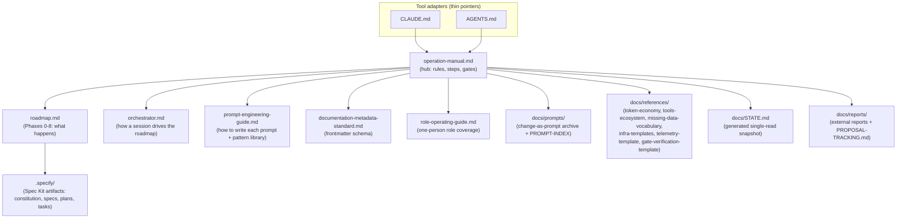
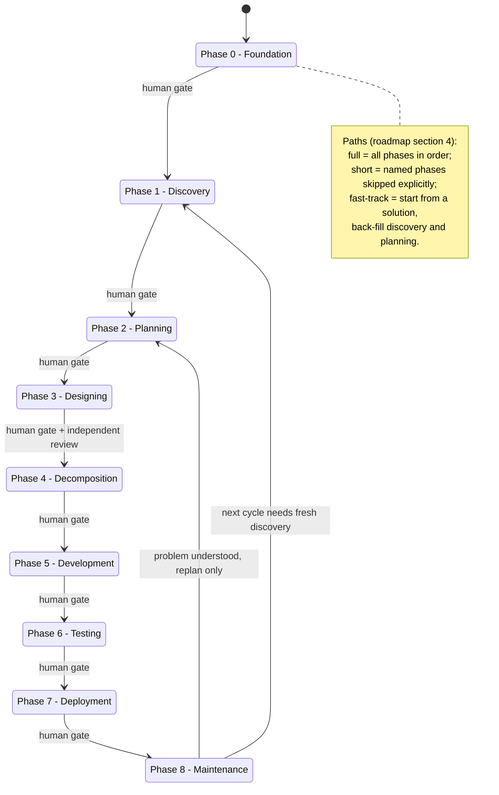
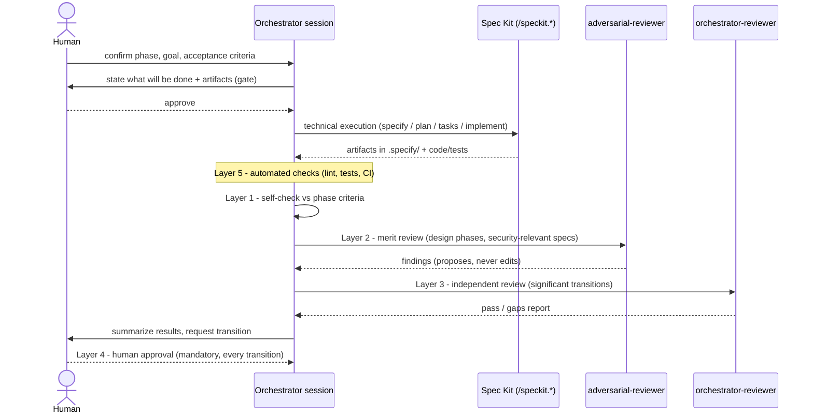
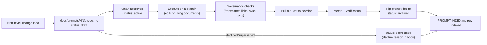
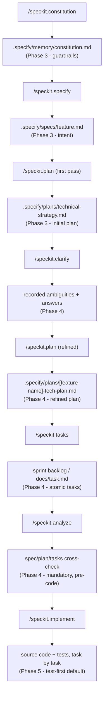
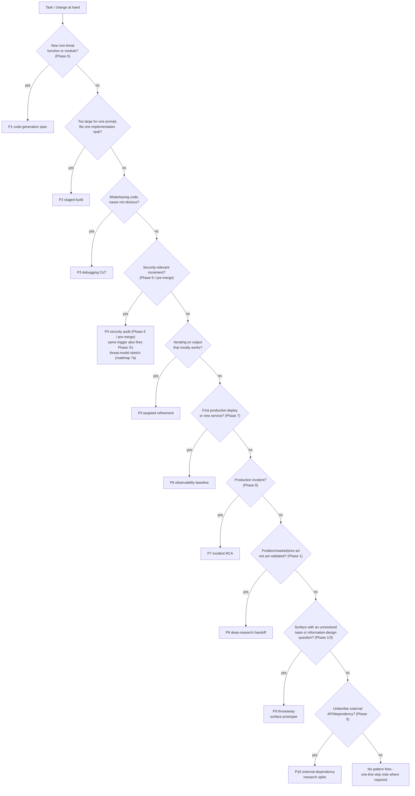

# Template Visual Overview

Changelog of this document:

- v1.14: Section 3's `REFS` node gains `missing-data-vocabulary`, per this file's own rule that a diagram is reviewed in the same change as the documents it visualizes - two version bumps in this batch had passed without that review (`fix-verifier` pass).
- v1.13: Section 6's flowchart entry node reworded from "Task / increment at hand" to "Task / change at hand" - it was the one use of the word that meant neither the release cycle nor the Scrum Increment. `Q4`'s "Security-relevant increment?" is the delivered-capability sense and stays (`008-market-standard-vocabulary`).
- v1.12: Section 6's runtime-trigger flowchart `Q9`/`P9` nodes re-worded to match P9's widened scope in `docs/manuals/prompt-engineering-guide.md` (v1.1: surface prototype, taste **or** information design), keeping the three copies of that trigger in sync (`006-absorb-local-notes-011-accepted-items`).
- Older entries: see `git log --follow` on this file (retention per `docs/manuals/documentation-metadata-standard.md` Section 2.1, prompt-033).

---

**Diagrams orient, prose governs.** No rule lives only here: each diagram links to the canonical document that owns its content, and node labels stay at stable altitude (phase names, document names, gate names) so the pictures rarely need to change. When the documents a diagram visualizes change shape, review the diagram in the same change ([prompt-engineering-guide.md](../manuals/prompt-engineering-guide.md), Section 11).

## 1. Document map

How the pieces relate. Canonical component table: [operation-manual.md](../manuals/operation-manual.md), "Document map". The repository README embeds a copy of this diagram as its visual entry point; this file is canonical for it - change it here first, then mirror to README.

## 2. Roadmap state machine

Phases and gates. Canonical definition: [roadmap.md](../strategy/roadmap.md); every transition requires human approval (operating rule 7).

## 3. Phase-execution sequence

One phase from entry to transition, with the layered validation model ([operation-manual.md](../manuals/operation-manual.md), Step 14 — the diagram below shows layers 1-5, which fire at a phase transition; layer 6 is trigger-gated and layer 7 runs at cycle close) and the summarize-and-confirm gates (Step 10).

## 4. Prompt lifecycle

The change-as-prompt rule for this template repository ([operation-manual.md](../manuals/operation-manual.md), Step 12).

## 5. Spec Kit artifact flow

The technical execution engine and where each command's artifact lands ([operation-manual.md](../manuals/operation-manual.md), Steps 4-5).

## 6. Runtime-trigger decision flow

Skip-by-default pattern selection ([prompt-engineering-guide.md](../manuals/prompt-engineering-guide.md), Section 12). A non-matching change pays one skip line.

